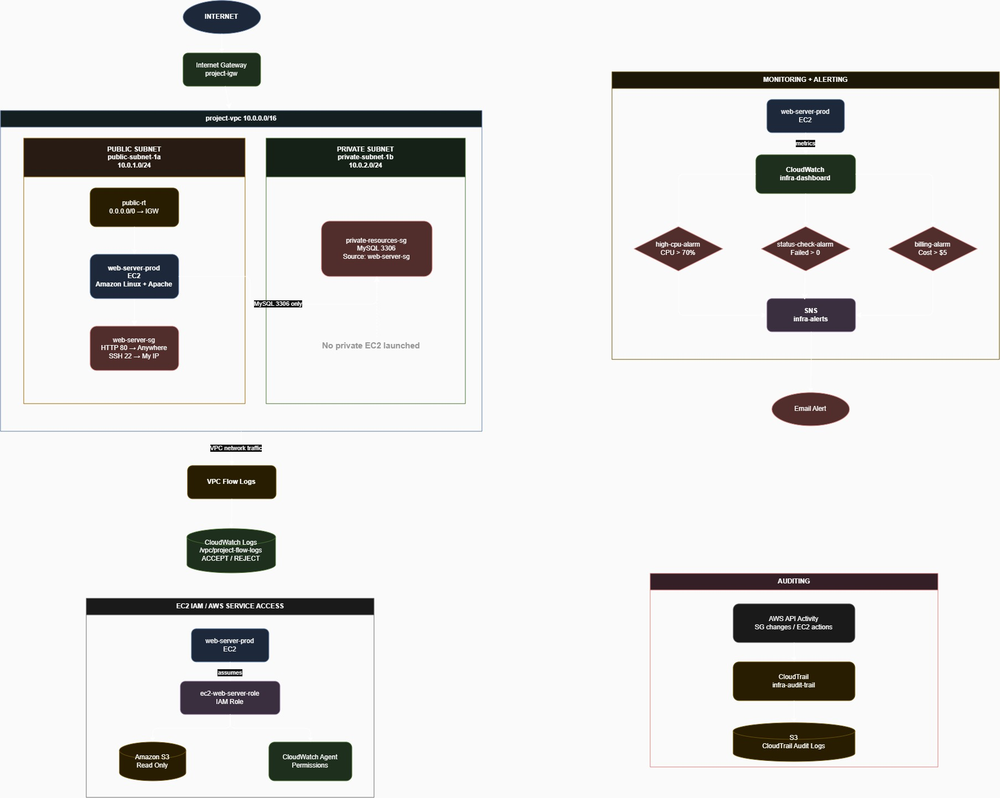

# Secure and Monitored AWS EC2 Web Infrastructure

A hands-on AWS portfolio lab demonstrating network segmentation, role-based service access, infrastructure monitoring, alerting, audit logging, and network-flow visibility around an Amazon Linux EC2 web server.

> This is a learning environment built manually in the AWS console, not a production deployment or an Infrastructure-as-Code template. All billable resources were removed after validation.

## Architecture

### Network layout

- VPC: `10.0.0.0/16`
- Public subnet: `10.0.1.0/24`
- Private subnet: `10.0.2.0/24`
- Internet Gateway and public route table for the public subnet
- Amazon Linux 2023 EC2 instance with Apache in the public subnet
- Security Group rules for HTTP and restricted administrative access
- Private-subnet Security Group design for MySQL access from the web-server Security Group

The private subnet was created to demonstrate segmentation; no private EC2 or database workload was launched.

## AWS services used

- Amazon VPC and Security Groups
- Amazon EC2
- AWS Identity and Access Management (IAM)
- Amazon CloudWatch
- Amazon Simple Notification Service (SNS)
- AWS CloudTrail
- Amazon S3
- VPC Flow Logs and CloudWatch Logs

## What I implemented

### 1. EC2 web server

Launched an Amazon Linux 2023 instance and installed Apache through EC2 user data. The script requests an IMDSv2 token before reading the instance ID, Availability Zone, and instance type for the demonstration page.

### 2. IAM role-based access

Attached an EC2 instance role so the server could call approved AWS services without storing access keys on the instance. The lab role used `AmazonS3ReadOnlyAccess` and `CloudWatchAgentServerPolicy`.

The administrative IAM user used broad AWS-managed permissions while building the lab. This is acceptable only in a disposable learning account. A production implementation should replace those permissions with task-specific policies. The repository includes a small read-only monitoring policy as a least-privilege exercise.

### 3. Monitoring and notifications

Configured CloudWatch monitoring and three alarms:

- `high-cpu-alarm`
- `status-check-alarm`
- `billing-alarm`

Connected the operational alarms to an SNS topic and verified an email notification by generating high CPU utilization.

### 4. Auditing

Enabled CloudTrail management-event logging with S3 storage. Reviewed events such as `AuthorizeSecurityGroupIngress`, `StartInstances`, and `StopInstances` to understand who performed an action, when it occurred, and which resource was affected.

### 5. Network visibility

Delivered VPC Flow Logs to CloudWatch Logs and filtered the records to confirm both:

- `ACCEPT` traffic permitted by the network controls
- `REJECT` traffic blocked by the network controls

## Repository structure

| Path | Purpose |
|---|---|
| `architecture/` | Infrastructure architecture diagram |
| `policies/readonly-monitoring-policy.json` | Read-only monitoring policy example |
| `scripts/user-data.sh` | Apache installation and IMDSv2 metadata page |
| `screenshots/` | Console evidence captured during implementation and testing |

## Troubleshooting performed

- Identified that EC2 permissions do not automatically grant IAM permissions.
- Learned how `iam:PassRole` controls whether an identity can attach a role to an AWS service.
- Used an EC2 role instead of placing long-term AWS credentials on the instance.
- Corrected EC2 Instance Connect access by using the appropriate AWS-managed prefix-list source.
- Generated CPU load to test the complete CloudWatch alarm-to-SNS notification path.
- Created a dedicated delivery role for VPC Flow Logs and verified the resulting log records.

## Security notes

- MFA was enabled for the lab IAM user.
- No private key, secret access key, password, or `.env` file is stored in this repository.
- The `.gitignore` excludes common credential-file formats.
- AWS account IDs, ARNs, IP addresses, and resource IDs visible in screenshots should be redacted before the repository is used as a public portfolio link.

## Cleanup

After collecting the implementation evidence, I removed the EC2 instance, networking components, alarms, dashboard, trail, Flow Logs, log groups, and related storage resources to prevent further charges.

## Key learning

This project helped me distinguish between complementary AWS operational controls:

- **Security Groups** control network access.
- **IAM roles and policies** control AWS API permissions.
- **CloudWatch** monitors infrastructure health.
- **SNS** delivers notifications.
- **CloudTrail** records AWS API activity.
- **VPC Flow Logs** record allowed and rejected network traffic.

## Status

Lab implementation and cleanup completed. The next improvement is to reproduce the architecture with Infrastructure as Code after strengthening Terraform fundamentals.
